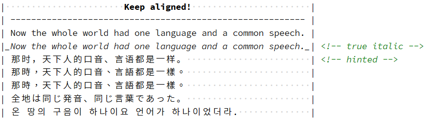

# Milky Han Mono 星汉等宽 / 星漢等寬 / 星漢等幅 / 성한 고정폭

Milky Han Mono, is not only a duospaced CJK programming font family, but also a framework to [create your programming font](doc/customization.md).

> 日月之行，若出其中。星漢燦爛，若出其裏。

## Get Milky Han Mono

See [the download guide](doc/download.md).

## Create your programming font

See [the guide for building with alternative Latin font](doc/customization.md).

## Credits

Based on [Sarasa Gothic](https://github.com/be5invis/Sarasa-Gothic), [Source Code Pro](https://github.com/adobe-fonts/source-code-pro), and [Source Han Sans](https://github.com/adobe-fonts/source-han-sans).

Inspired by [discussion in an issue thread of Sarasa](https://github.com/be5invis/Sarasa-Gothic/issues/108#issuecomment-516340560).
