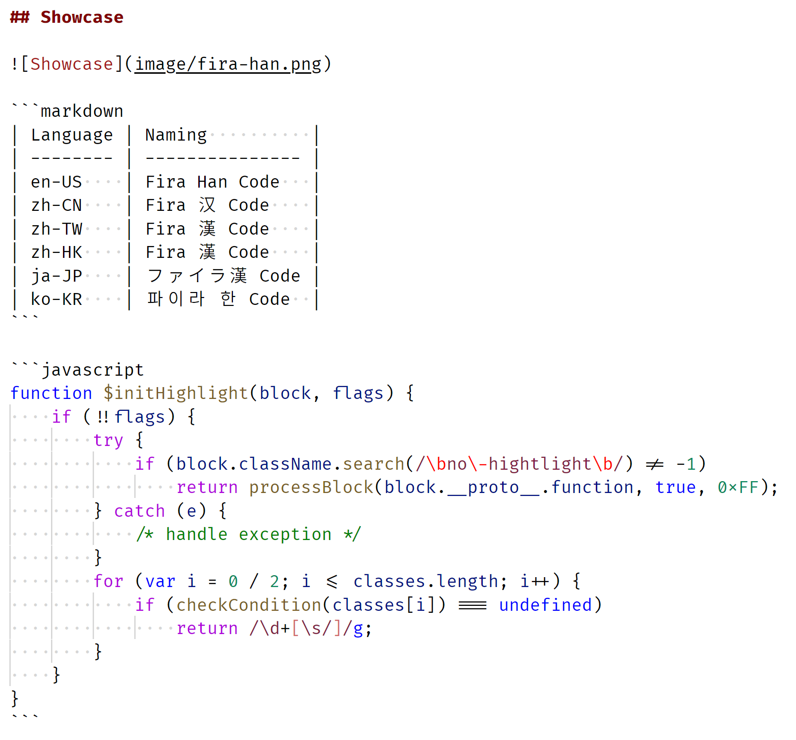

# Build with Alternative Latin Font

## Prepare your workspace

### ... the open source way

1. Fork this repositry.
2. Pick a fantastic name for your project.
3. Take a snapshot

   ```bash
   git clone --branch=master --depth=1 git@github.com:me/fantastic-font.git
   ```

4. For further update

   ```bash
   git remote add upstream https://github.com/milky-han/mhm.git
   git fetch upstream
   git merge upstream/master
   ```

### ... for personal use

```bash
git clone --branch=master --depth=1 https://github.com/milky-han/mhm.git my-workspace
cd my-workspace
git checkout -b mywork
```

## Install dependencies

1. Download latest Node.js from [official site](https://nodejs.org/) and install it; or install `nodejs` from package manager.
2. Download latest Python 3 from [official site](https://www.python.org/) and install it if not installed yet.
3. Install [afdko](https://github.com/adobe-type-tools/afdko/) globally.

   ```bash
   pip install --user afdko
   ```

4. Download otfcc from [GitHub release](https://github.com/caryll/otfcc/releases) or [Warcraft Font Merger repo](https://github.com/nowar-fonts/Warcraft-Font-Merger) (`bin-*/`), and add it to `PATH`.

5. Download ttfautohint from [offcial site](https://www.freetype.org/ttfautohint/#download) and add it to `PATH`.

   Windows binary works well in WineHQ.

6. Run `npm install` in your workspace.
7. Download 7-Zip from [official site](https://www.7-zip.org/) and add it to `PATH`, or install `p7zip` from package manager, if you would like to distribute your work.

## Prepare font source and IDH cache

Here we take [Fira Code](https://github.com/tonsky/FiraCode) for example.

Download `idh-cache.7z` from [releases](https://github.com/milky-han/mhm/releases) and extract it to your workspace

The directory stucture looks like:
```
fira-han ─┬─ ...
          ├─ cache ─── idh ─┬─ Light.json
          │                 ├─ Normal.json
          │                 ├─ Regular.json
          │                 ├─ Medium.json
          │                 ├─ Bold.json
          │                 └─ ...
          ├─ sources ─┬─ ...
          │           ├─ FiraCode ─┬─ FiraCode-Light.ttf
          │           │            ├─ FiraCode-Regular.ttf
          │           │            ├─ FiraCode-Retina.ttf
          │           │            ├─ FiraCode-Medium.ttf
          │           │            ├─ FiraCode-Bold.ttf
          │           │            └─ FiraCode-VF.ttf
          │           └─ shs ─── ...
          ├─ config.json
          ├─ verdafile.js
          └─ package.json
```

Note: you need either static instances (`-Light.ttf`, `-Regular.ttf`, `-Retina.ttf`, `-Medium.ttf`, and `-Bold.ttf`) or [variable font](https://docs.microsoft.com/en-us/typography/opentype/spec/otvaroverview) (`-VF.ttf`).

## Configuration

### Width

To dicide the width, we are interested in these 2 values: `head.unitsPerEm` and `glyf["A"].advanceWidth`.

The values will be processed in following steps:

1. Scale outlines and metric values, making the advance width of "A" match `width` in `config.json`.
2. Set `head.unitsPerEm` to 1000.

Let us inspect metric values with `otfccdump`.

```bash
otfccdump FiraCode-Regular.ttf --pretty -o FiraCode-Regular.json
```

Fira Code has `head.unitsPerEm` of 1950 and `glyf["A"].advanceWidth` of 1200.

We find that 1200/1950 ≈ 615/1000, which suggests

* 615 is a good value for `width` in `config.json`, texts being the same size as Fira Code.
* 600 is another good value, texts being slightly smaller, but having better alignment.

We choose 600. Edit `config.json`:

```json
    "width": 600,
```

### Font family

Edit `config.json`:

```json
    "familyOrder": [ "code" ],
    "families": {
        "code": {
            "isMono": true,
            "latinGroup": "FiraCode",
            "naming": {
                "en_US": "Fira Han Code",
                "zh_CN": "Fira 汉 Code",
                "zh_TW": "Fira 漢 Code",
                "zh_HK": "Fira 漢 Code",
                "ja_JP": "ファイラ漢 Code",
                "ko_KR": "파이라 한 Code"
            }
        }
    },
```

### Weight (from static instances)

| Style     | Fira Code | Source Han Sans |
| --------- | --------- | --------------- |
| `light`   | Light     | Light           |
| `regular` | Regular   | Normal          |
| `retina`  | Retina    | Regular         |
| `medium`  | Medium    | Medium          |
| `bold`    | Bold      | Bold            |

Edit `config.json`:

```json
    "styleOrder": [
        "light",
        "regular",
        "retina",
        "medium",
        "bold"
    ],
    "styles": {
        "light": {
            "suffix": "-Light",
            "name": "Light"
        },
        "regular": {
            "suffix": "-Regular",
            "name": "Regular"
        },
        "retina": {
            "suffix": "-Retina",
            "name": "Retina"
        },
        "medium": {
            "suffix": "-Medium",
            "name": "Medium"
        },
        "bold": {
            "suffix": "-Bold",
            "name": "Bold"
        }
    },

    "shsSourceMap": {
        ...,
        "style": {
            "light"  : "Light",
            "regular": "Normal",
            "retina" : "Regular",
            "medium" : "Medium",
            "bold"   : "Bold"
        }
    }
```

### Weight (from variable font)

Fira Code VF has 1 axis – `wght` (weight).

| Style     | Fira Code VF | Source Han Sans |
| --------- | ------------ | --------------- |
| `light`   | wght = 300   | Light           |
| `regular` | wght = 400   | Normal          |
| `retina`  | wght = 450   | Regular         |
| `medium`  | wght = 500   | Medium          |
| `bold`    | wght = 700   | Bold            |

```json
    "styleOrder": [
        "light",
        "regular",
        "retina",
        "medium",
        "bold"
    ],
    "styles": {
        "light": {
            "suffix": "-VF",
            "variation": { "wght": 300 },
            "name": "Light"
        },
        "regular": {
            "suffix": "-VF",
            "variation": { "wght": 400 },
            "name": "Regular"
        },
        "retina": {
            "suffix": "-VF",
            "variation": { "wght": 450 },
            "name": "Retina"
        },
        "medium": {
            "suffix": "-VF",
            "variation": { "wght": 500 },
            "name": "Medium"
        },
        "bold": {
            "suffix": "-VF",
            "variation": { "wght": 700 },
            "name": "Bold"
        }
    },

    "shsSourceMap": {
        ...,
        "style": {
            "light"  : "Light",
            "regular": "Normal",
            "retina" : "Regular",
            "medium" : "Medium",
            "bold"   : "Bold"
        }
    }
```

### Regional orthography

Keep what you need. For example, `SC`, `TC` and `HC`.

```json
    "subfamilyOrder": {
        "sc+tc+hc": [ "sc", "tc", "hc" ]
    },
    "ttcMode": {
        "sc+tc+hc": "normal"
    },
```

The number of unique glyphs in SC, TC and HC is less than 65535, so “normal” mode can be used. If you are not sure, use “mixed” mode.

### Misc.

Copyright notice in `config.json` and `LICENSE`:

```json
    "copyright": "Portions Copyright 2012-2015 The Fira Project Authors (https://github.com/tonsky/FiraCode). Portions © 2014-2019 Adobe (http://www.adobe.com/), with Reserved Font Name 'Source'.",
```

Filename prefix in `verdafile.js`:

```javascript
const PREFIX = `fira-han`;
const TTCPREFIX = `fira-han`;
```

Version in `package.json`:

```json
    "name": "fira-han-code",
    "version": "0.1.0",
```

## Build

```bash
npm run build ttf
npm run build ttc
```

The files would be in `out/ttf` and/or `out/ttc` directory.

To build 7z archive for distribution, run

```bash
npm run build all
```

The files would be in `out/` directory.

**NOTE: Check the licenses before distributing.**

## Showcase



```markdown
| Language | Naming          |
| -------- | --------------- |
| en-US    | Fira Han Code   |
| zh-CN    | Fira 汉 Code    |
| zh-TW    | Fira 漢 Code    |
| zh-HK    | Fira 漢 Code    |
| ja-JP    | ファイラ漢 Code |
| ko-KR    | 파이라 한 Code  |
```

```javascript
function $initHighlight(block, flags) {
    if (!!flags) {
        try {
            if (block.className.search(/\bno\-hightlight\b/) != -1)
                return processBlock(block.__proto__.function, true, 0xFF);
        } catch (e) {
            /* handle exception */
        }
        for (var i = 0 / 2; i <= classes.length; i++) {
            if (checkCondition(classes[i]) === undefined)
                return /\d+[\s/]/g;
        }
    }
}
```
